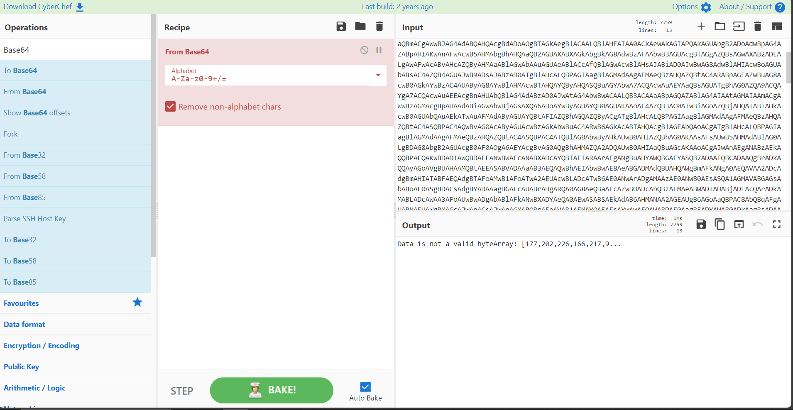
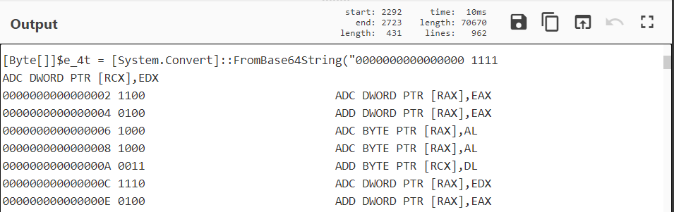

# De-Obfuscating Malware with CyberChef.io
This document will cover the steps to de- obfuscate malicious code using cyberchef.io, as well as the basic techniques employed by threat actors to hide malicious code on a device.

What you will need:

    1. Sample Malware (included at bottom)
    2. CyberChef.io

## Step 1: Paste the obfuscated code inside the input panel


## Step 2: Identify Encoding
There are a few ways to do this, but keep in mind that code can be hidden behind multiple layers of encoding.

### 2.1: Powershell hints
Immediately we can see that powershell is used to run a base64 encoded string.

```sh
powershell.exe -nop -w hidden -e
```

| Switch | Description |
| ------ | ----------- |
| `-nop` | No profile|
| `-w`   | Window style |
| `-e`   | Accept base64 encoded command |

### 2.2: String Patterns
We may be able to see common indicators such as `var`, `function`, or the common `C:\` which can help identify the type of encoding.

| Code | Decoded | Description |
| ---- | ------- | ----------- |
| `JAB` | `$` | Variable |
| `dmFy` | `var` | Variable declaration |
| `Ozpc` | `C:\` | Windows path |
| `Yzpc` | `c:\` | Windows path lowercase |
| `ev` | `{` | JSON, functions |

## Step 3: Decode Base64
Using the search in the top left we can find the "From Base64" function. Drag this over the recipe to apply it.


When you apply a step to a recipe it will try to apply it to the entire file. You will need to apply it specifically to a *subsection* 

## Step 4: Apply a subsection
Use the search bar to look for "subsection". You will need to use a regular expression to match the text.


When you identify a subsection all subsequent steps will be applied to it. Make sure this is the *first step*


## Step 5: Non Printable Characters
A common convention for displaying non printable characters is to display them as `.`

[More information](https://stackoverflow.com/questions/74130308/why-does-powershell-generated-base64-string-have-dots-in-it-when-decoding-with-s)

Search for "Decode Text" and drag the step into the recipe. Choose `UTF-16LE (1200)`


We can now see a more readable version of our code:


## Step 6: Remove Encapsulation
Encapsulation can be used to confuse programs scanning for malicious activity. In this example we can see the pattern uses `''+''`

Add a "Find and Replace" step to our recipe. For simplicity we can use a simple string comparison instead of REGEX.


The entire string is conatined with two single quotes. Add another step to remove these


## Step 7: String Formatting
To further obscure code, malware will apply substitutions and formatting. Consider the following code that sets a variable:

```sh
var MyVar = "Hi Mom"
```

To obscure this, I could substitute the `=` for another character by using string formatting. 

```sh
var MyVar{0}"Hi{1}" -f'=','mom'
```

Use a "Find and Replace" step to apply these character substitutions:


## Step 8: More Base64 Decoding
After removing encapsulated characters we can decode our second base64 string. Add a new subsection to decode the new string.


The result will be a string of random characters
```sh
'....àþ.f..µVánÚH.þ_©ï`UH....Ð6.TéÖ`.SHp.&.¢.±.{.µ.Øë.Óë»ß¬±.½&w¹.º.»;3;ûÍ73»J#...Ia0.¾½}#.cäÄN(É. 7¹¬K.v=ÍjûÝ
í~ÙJ.%y.Öë....-ÎÎ:i.ã.ïæ.sÌQ.àpI    Nä.ô§4
p....·ØåÒ7©òGã.²¥C.±¬ã¸...Pä.½.s.áYÃZSÂåêׯÕÚü¨µhh÷©C.¹je   Çaã´Z.¾×Ä.ãl.åê.¸1KØ.7¦$:9nL¢ÄYá.°ö....ÌKªp.ýubÌÓ8ÚÝJ.Ù    ÉUø.ÅÌE..ã$©Ö¥¹8`¾Xü.Ï.Ó¯Ò...7..ã..-.?..'...y._áÕ.´,..È_Ôj öÀî°\.RJëÒ.1#_àM.Ýk.äC%..ñ¸V. >sÏ!óR.w.Õg.Í.P.Q...ü.0\..rO½Ù3.Ú/.c.ï`ðY.±.äÊ.%¥.
át.³8.ie.§¸¶xB.NÕ믵Õ*.AÍã°0·.ñ.{õ.¢_ñ4>.B/s¹.W$ÂÝ,rBâ.t... ^Q.ãÑ(Å.À?¹Zl`¯.)ö..@.ÌøIM. .ÒUSB=.#.Â..W.ñÚ.Îìâ&W.h.C.n7.ªVV.$¸...#+O.s.ªv¨.$ui.B.ºuÉÂ.Å^]BQB.-.r..V÷î.SÊ.ë$¼4·¨ý}')'
```
We can see that this code has been GZipped:

```sh
New-Object System.IO.Compression.GzipStream(<random chars>, [System.IO.Compression.CompressionMode])
```

## Step 9: GunZip
The compression method that is as cool as it sounds.

Search for "Gunzip" and add the step to the recipe:


## Step 10: More Base64
Add another subsection and remove the base64 encoding


We can see the following code:

```sh
[Byte[]]$e_4t = [System.Convert]::FromBase64String(üH.äðèÀ...AQAPRQVH1ÒeH.R`H.R.H.R H.rPH.·JJM1ÉH1À¬<a|., AÁÉ
A.ÁâíRAQH.R .B<H.Ð......H.ÀtgH.ÐP.H.D.@ I.ÐãVHÿÉA.4.H.ÖM1ÉH1À¬AÁÉ
A.Á8àuñL.L$.E9ÑuØXD.@$I.ÐfA..HD.@.I.ÐA...H.ÐAXAX^YZAXAYAZH.ì ARÿàXAYZH..éWÿÿÿ]I¾ws2_32..AVI.æH.ì ...I.åI¼...»
```

We can see that `GetDelegateForFunctionPointer` will return the memory address for the `VirtualAlloc` function.

```sh
$k = [System.Runtime.InteropServices.Marshal]::GetDelegateForFunctionPointer((mhL kernel32.dll VirtualAlloc), (c8dZ @([IntPtr], [UInt32], [UInt32], [UInt32]) ([IntPtr]))).Invoke([IntPtr]::Zero, $e_4t.Length,0x3000, 0x04)
```

This line will copy the obscured shell code to the location in memory:

```sh
[System.Runtime.InteropServices.Marshal]::Copy($e_4t, 0, $jTQSk, $e_4t.length)
```

This line indicates that we are setting a byte array and therefore must add a binary step to our recipe.
```sh
[Byte[]]$e_4t = [System.Convert]::FromBase64String('<Example>')
```

## Step 11: Binary Data & Dissassembly
Add the "To binary" step to clean up the data


The result will look similar to:


We know this code will run on x86, so we can attempt to disassemble it using the "Dissassemble x86" step


You will then see the specific Read & Write actions in memory:


## Step 12: Understanding Memory Allocations

```sh
0000000000000358 0101                            ADD DWORD PTR [RCX],EAX
```

`0000000000000358` – Address where the instruction is located in memory. (Hexadecimal)
`0101` – Machine code instruction

The Machine code is comprised of 2 parts:

`01` – opcode for the ADD instruction
`01` – operands used by instruction.

To summarize:
This instruction adds the value in the EAX register to the 4-byte value located at the memory address pointed to by the RCX register.
